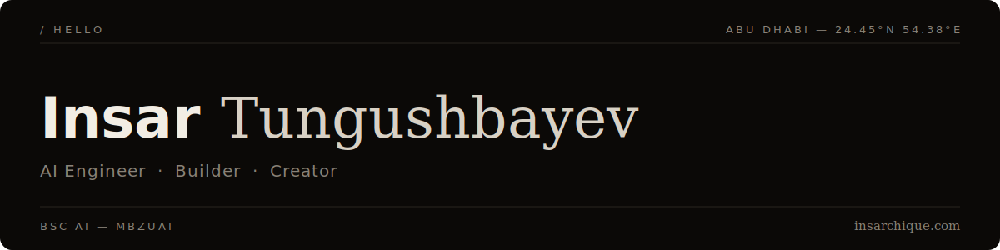

  
    1st Place Microsoft Imagine Cup UAE&nbsp;&nbsp;·&nbsp;&nbsp;MIT EECS Research&nbsp;&nbsp;·&nbsp;&nbsp;Founder, Research Orda&nbsp;&nbsp;·&nbsp;&nbsp;AI Engineer @ Antler&nbsp;&nbsp;·&nbsp;&nbsp;HackNU '26 Winner
  

AI Engineer & Founder — BSc AI, [MBZUAI](https://mbzuai.ac.ae) (Abu Dhabi). I build the whole thing — from research code to the App Store.

**Building**
- [LINA](https://lina-landing.vercel.app/) — AI companion for pregnancy and the first year of motherhood

**Shipped**
- [Samara AI](https://samara-ai.uk) — voice AI that runs live IELTS speaking exams, scores you in real time
- [Findly](https://getfindly.app) — matches students to scholarships, internships, and grants they'd never find on their own
- [Wadduha](https://apps.apple.com/app/wadduha-prayer-alarms-more/id6779082467) — prayer times and alarms for Muslims, iOS
- [Quran Alias](https://apps.apple.com/app/quran-alias/id6785245846) — a word game that teaches Quranic Arabic, iOS

**Stack**

Python · TypeScript · React · Next.js · PyTorch · LLM Agents (Claude/OpenAI APIs) · Realtime Voice APIs · PostgreSQL

**Links**

[insarchique.com](https://insarchique.com) · [LinkedIn](https://linkedin.com/in/insarchique) · [Instagram](https://instagram.com/1nsar_champ)

<!--
**1nsar/1nsar** is a ✨ _special_ ✨ repository because its `README.md` (this file) appears on your GitHub profile.

Here are some ideas to get you started:

- 🔭 I’m currently working on ...
- 🌱 I’m currently learning ...
- 👯 I’m looking to collaborate on ...
- 🤔 I’m looking for help with ...
- 💬 Ask me about ...
- 📫 How to reach me: ...
- 😄 Pronouns: ...
- ⚡ Fun fact: ...
-->

