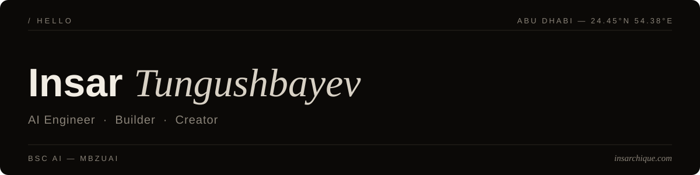
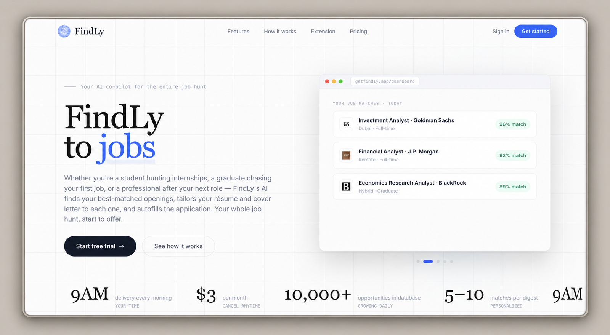
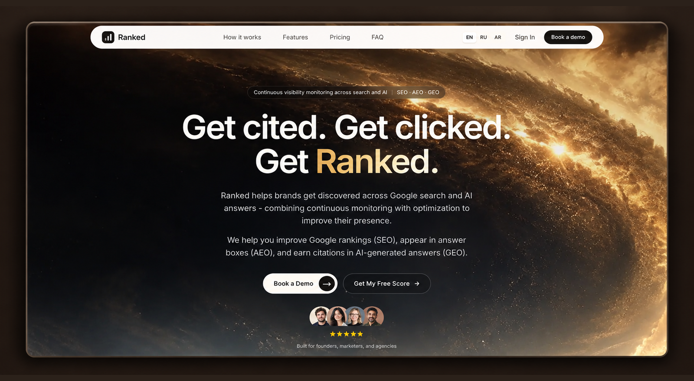
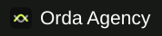
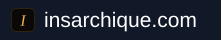
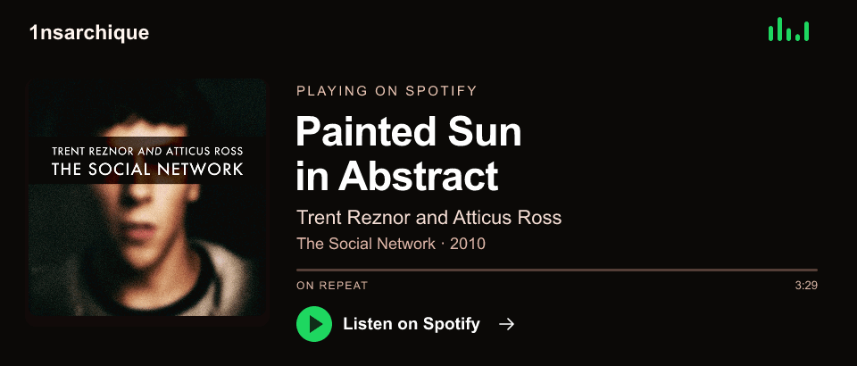

  
    1st Place Microsoft Imagine Cup&nbsp;&nbsp;·&nbsp;&nbsp;MIT EECS Research&nbsp;&nbsp;·&nbsp;&nbsp;Founder, Research Orda&nbsp;&nbsp;·&nbsp;&nbsp;AI Engineer @ Antler&nbsp;&nbsp;·&nbsp;&nbsp;HackNU '26 Winner
  

<table>
  <tr>
    <td width="50%" valign="top">
      
      
<b>FindLy</b> is your AI copilot for your entire job hunt. Discover relevant opportunities, build and tailor your résumé, and autofill applications. Keep every application and deadline in view, from your first search to your next move. <a href="https://getfindly.app/"><b>Find your next opportunity →</b></a>

    </td>
    <td width="50%" valign="top">
      
      
<b>Ranked</b> helps your brand get discovered across Google search and AI answers. Track rankings, mentions, and citations, see where your brand appears, and turn visibility gaps into clear next steps. Get cited. Get clicked. Get Ranked. <a href="https://rankedly.co/"><b>Get your free visibility score →</b></a>

    </td>
  </tr>
</table>

  &nbsp;Python &nbsp;·&nbsp;
  &nbsp;TypeScript &nbsp;·&nbsp;
  &nbsp;Swift &nbsp;·&nbsp;
  &nbsp;React&nbsp;Native &nbsp;·&nbsp;
  &nbsp;Next.js &nbsp;·&nbsp;
  &nbsp;PyTorch &nbsp;·&nbsp;
  &nbsp;Generative&nbsp;Models
   
  &nbsp;LLM&nbsp;Agents &nbsp;·&nbsp;
  &nbsp;FastAPI &nbsp;·&nbsp;
  &nbsp;TensorFlow &nbsp;·&nbsp;
  &nbsp;LangGraph &nbsp;·&nbsp;
  &nbsp;Firebase &nbsp;·&nbsp;
  &nbsp;NumPy &nbsp;·&nbsp;
  &nbsp;Pandas

  
  
  

